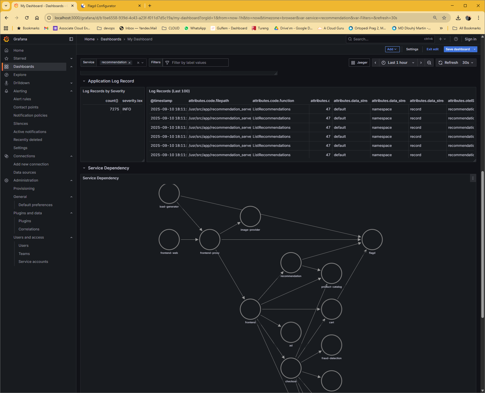

# Observability for OpenTelemetry Demo on GCP

This document outlines the approach and design decisions for enhancing the observability of the OpenTelemetry Demo application deployed on Google Kubernetes Engine (GKE). The goal is to provide comprehensive, production-ready monitoring and alerting capabilities as per the assignment requirements.

## 1. Deployment and Instrumentation

### Infrastructure Overview

The OpenTelemetry Demo application was deployed on Google Kubernetes Engine (GKE) using Terraform for Infrastructure as Code (IaC) and Helm for application deployment. This provides a production-like environment with built-in observability instrumentation across multiple microservices.

**Key Components:**
- **GKE Cluster**: Managed Kubernetes environment on GCP
- **Terraform IaC**: Automated infrastructure provisioning
- **Helm Deployment**: Official OpenTelemetry Demo chart with 10+ instrumented microservices
- **Built-in Telemetry**: Automatic metrics, traces, and logs collection

The demo includes realistic services (frontend, cart, checkout, payment, etc.) with comprehensive OpenTelemetry instrumentation, providing rich observability data for monitoring and alerting.

## 2. Metrics Visualization and Dashboarding

### Dashboard Design Philosophy

The Grafana dashboard was designed with three core principles in mind:

### Dashboard Design Philosophy

The Grafana dashboard follows a structured observability approach, integrating multiple data sources into a cohesive monitoring solution:

**Data Source Integration:**
- **Row 1 & 2 - Prometheus Metrics**: Infrastructure health (CPU, Memory) and RED metrics (Rate, Errors, Duration) from Prometheus for real-time performance monitoring
- **Row 3 - OpenSearch Logs**: Application logs and log severity analysis from OpenSearch for behavioral insights and error pattern detection
- **Row 4 - Jaeger Tracing**: Service dependency visualization from Jaeger for understanding request flows and system architecture

**Navigation Integration**: A direct Jaeger link is positioned at the top of the dashboard (next to service filters), enabling engineers to seamlessly transition from metrics/logs to distributed tracing. Users can take trace IDs from logs and directly investigate detailed request paths in Jaeger.


**Core Design Principles:**

1.  **Clarity**: The dashboard provides hierarchical observability - starting with infrastructure health (Prometheus), drilling into application behavior (logs from OpenSearch), and enabling deep trace analysis (Jaeger). This layered approach gives engineers a complete system view from infrastructure to individual request traces.

2.  **Information Density**: Each row serves a specific observability purpose without overlap. Prometheus delivers quantitative performance data, OpenSearch provides qualitative behavioral insights, and Jaeger offers detailed request flow analysis. This multi-source approach ensures comprehensive coverage while maintaining focused, actionable information density.

3.  **Actionable Insights**: Every panel answers specific operational questions - Prometheus metrics reveal "what's happening" (performance degradation), OpenSearch logs explain "why it's happening" (error patterns, application state), and Jaeger traces show "how it's happening" (request paths, service interactions). The integrated Jaeger link enables immediate deep-dive investigation from any metric anomaly or log pattern.

The dashboard includes template variables for service filtering, allowing engineers to focus on specific services or view system-wide metrics across all services simultaneously.


*Main dashboard view showing the complete observability suite with System Health and RED metrics sections*

### Detailed Dashboard Panel Analysis

The dashboard is organized into two main sections: **System Health** and **RED Metrics**, providing comprehensive monitoring coverage.

#### System Health Section


*Top section showing infrastructure health metrics*

**1. Pod CPU Usage (%)**
- **Query**: `100 * sum(rate(container_cpu_usage_seconds_total{namespace="otel-demo"}[5m])) by (pod) / scalar(sum(machine_cpu_cores))`
- **Purpose**: Monitors CPU utilization across all pods in the otel-demo namespace as a percentage of total available CPU cores
- **Design Decision**: Shows percentage rather than raw CPU seconds to make it immediately actionable. The 5-minute rate provides smoothed data to avoid noise from brief spikes
- **Threshold**: Visual threshold at reasonable CPU limits to quickly identify resource-constrained pods

**2. Pod Memory Usage (GB)**
- **Query**: `sum by(pod) (container_memory_working_set_bytes{namespace="otel-demo", pod!=""}) / 1024 / 1024 / 1024`
- **Purpose**: Tracks memory consumption in gigabytes for all pods, using working set memory which represents actual memory in use
- **Design Decision**: Converted from bytes to GB for readability. Working set memory is chosen over other memory metrics as it reflects actual memory pressure
- **Actionability**: Helps identify memory leaks or pods approaching memory limits before they get OOMKilled

#### RED Metrics Section


*Detailed RED metrics showing Rate, Errors, and Duration for comprehensive service monitoring*

**3. Request Rate**
- **Query**: Complex query using `label_join` and `label_replace` to create readable service/route combinations
- **Purpose**: Shows the number of HTTP requests per second, broken down by service and route
- **Custom Enhancement**: Uses regex `".*/([^/]+)$"` to extract only the last segment of HTTP routes, making labels cleaner (e.g., "/api/v1/users" becomes just "users")
- **Service Template Variable**: Leverages `$service` variable allowing filtering by specific services or viewing "all"

**4. Error Rate by Service**
- **Query**: `sum by(service_name) (rate(traces_span_metrics_calls_total{service_name=~"$service",status_code="STATUS_CODE_ERROR"}[5m]))`
- **Purpose**: Tracks errors per second by service using OpenTelemetry span metrics
- **Design Decision**: Uses span-based error tracking rather than HTTP status codes to capture errors across all service interactions, not just HTTP
- **Alert Integration**: This metric directly feeds into the alerting system for proactive issue detection

**5. Latency in Milliseconds**
- **Query**: Calculates latency by dividing duration sum by request count for each service/route combination
- **Purpose**: Shows actual response times for each service endpoint
- **Custom Labels**: Same route simplification logic applied for consistent labeling across panels
- **Actionability**: Helps identify slow endpoints that may need optimization

**6. Average Duration by Span Name**
- **Query**: `histogram_quantile(0.50, sum(rate(traces_span_metrics_duration_milliseconds_bucket{service_name=~"${service}"}[$__rate_interval])) by (le, span_name))`
- **Purpose**: Shows p50 latency for different operations (spans) within services
- **Design Decision**: Uses histogram quantiles for more accurate latency representation than simple averages
- **Insight**: Reveals which specific operations within a service are contributing to latency

#### Additional Observability Panels

**7. Active Request Numbers**
- **Query**: Tracks currently active HTTP requests using `http_server_active_requests` metric
- **Purpose**: Shows real-time load on services, useful for capacity planning and identifying traffic spikes

**8. Application Log Record & Log Records by Severity**
- **Purpose**: Provides log-based insights to complement metrics
- **Implementation**: Shows log volume and severity distribution to identify patterns in application behavior
- **Integration**: Links logs to metrics timeline for correlated troubleshooting

**9. Service Dependency Visualization**
- **Purpose**: Shows service-to-service communication patterns
- **Value**: Helps understand system architecture and identify critical service paths

#### 3. Custom Enhancements and Innovations

#### 1. Advanced Label Engineering
The dashboard implements sophisticated label transformation to improve readability and usability:
```promql
label_replace(
  rate(http_server_request_duration_seconds_sum{service_name=~"$service"}[5m]),
  "short_http_route",
  "$1",
  "http_route",
  ".*/([^/]+)$"  # Extract last URL segment
)
```
This transformation converts verbose paths like `/api/recommendations/v1/products` to simply `products`, dramatically improving dashboard readability and making it easier to identify performance issues at a glance.

#### 2. Intelligent Metric Aggregation
- **Service-Route Combinations**: Creates meaningful labels that combine service names with simplified route names
- **Cross-Panel Consistency**: Ensures the same labeling logic across all dashboard panels
- **Query Optimization**: Uses efficient Prometheus functions to minimize query load

#### 3. Production-Focused Design Decisions
- **Consistent Time Ranges**: All panels use the same time selector for temporal correlation
- **Color Coordination**: Services maintain consistent colors across different panels for visual consistency
- **Direct Integration**: Built-in link to Jaeger for immediate trace analysis from any metric anomaly

## 3. Metric-Based Alerting

### Alerting Strategy and Philosophy

The alerting strategy is designed to be **actionable and avoid alert fatigue** through careful threshold selection and condition design. Alerts are triggered only for conditions that represent genuine, user-impacting problems requiring human intervention.

**Core Principles:**
- **User Impact Focus**: Alerts only fire when end users are affected
- **Actionable Conditions**: Every alert includes clear next steps and troubleshooting guidance
- **Appropriate Urgency**: Alert severity matches business impact
- **Noise Reduction**: Time-based conditions prevent flapping from transient issues

### Implemented Alert: High Error Rate


*Alert rules configuration showing comprehensive error rate monitoring*

**Alert Configuration Details:**
```yaml
- uid: bexalo8uhj37kd
  title: Error Rate
  condition: C
  data:
    - refId: A
      expr: "sum by(service_name) (rate(traces_span_metrics_calls_total{status_code=\"STATUS_CODE_ERROR\"}[5m]))"
    - refId: C
      conditions:
        - evaluator:
            params: [2] # Threshold: 2 errors per second
            type: gt
```

**Detailed Rationale:**

1. **Metric Selection**: `traces_span_metrics_calls_total{status_code="STATUS_CODE_ERROR"}`
   - **Why Spans Over HTTP**: Captures errors across all service interactions (gRPC, database calls, message queues), not just HTTP requests
   - **Rate Function**: `rate()[5m]` provides errors per second over a 5-minute window, smoothing transient spikes
   - **Service Aggregation**: `sum by(service_name)` allows pinpointing which service is experiencing issues

2. **Threshold Logic**: 2 errors per second
   - **Business Context**: Based on expected traffic volume and acceptable error budget
   - **Sensitivity Balance**: High enough to avoid noise from occasional failures, low enough to catch real issues
   - **Service-Specific**: Can be customized per service based on their individual SLAs

3. **Time Window**: 5-minute evaluation window
   - **Prevents Flapping**: Avoids alerts from brief error spikes during deployments
   - **Early Detection**: Short enough to catch issues before significant user impact
   - **Operational Practicality**: Gives engineers time to respond before escalation

### Advanced Alert Implementation: Baseline Comparison

Beyond the basic error rate alert, a more sophisticated alerting approach was implemented using **temporal baseline comparison** for detecting anomalous behavior patterns.

**Memory Usage Anomaly Alert:**
```yaml
expr: |
  (
    sum by(pod) (container_memory_working_set_bytes{namespace="otel-demo", pod!=""})
    /
    sum by(pod) (container_memory_working_set_bytes{namespace="otel-demo", pod!=""} offset 10m)
  )
```

**Advanced Query Logic:**
1. **Current Memory Usage**: `container_memory_working_set_bytes{namespace="otel-demo"}` 
2. **Baseline Comparison**: Same metric with `offset 10m` to get values from 10 minutes ago
3. **Ratio Calculation**: Current usage divided by historical baseline
4. **Threshold**: Alert triggers when current usage is 10x higher than 10 minutes ago

**Strategic Benefits:**
- **Dynamic Thresholding**: Adapts to normal application patterns rather than static limits
- **Anomaly Detection**: Catches unusual spikes even during different traffic patterns
- **Context Awareness**: A 2GB spike at 3AM is more significant than during peak hours
- **Reduces False Positives**: Prevents alerts during expected traffic variations

**Operational Value:**
This approach detects memory leaks, unexpected load patterns, or resource exhaustion issues by comparing current behavior to recent historical patterns, making it far more intelligent than static threshold alerting.

### Alert Notification Integration

The alerting system integrates with Discord for immediate team notification, providing both alert and resolution messages.

#### Active Alert Notification

*Discord alert notification showing the triggered condition, affected service, and direct link to dashboard for immediate investigation*

**Alert Message Contents:**
- **Service Identification**: Clear indication of which service is affected
- **Metric Value**: Current error rate vs. threshold for context
- **Direct Dashboard Link**: One-click access to full debugging context
- **Timestamp**: When the condition was first triggered
- **Severity Level**: Visual indicators for prioritization

#### Resolution Notification

*Resolution notification confirming the alert has cleared, providing closure for the incident*

**Resolution Message Benefits:**
- **Incident Closure**: Confirms the issue has resolved without manual intervention
- **Duration Tracking**: Shows how long the incident lasted
- **Automatic Cleanup**: Prevents stale alert notifications in team channels
- **Pattern Recognition**: Historical view helps identify recurring issues

### Advanced Alerting Considerations

#### Multi-Condition Alerting
The current implementation could be extended with compound conditions:
```yaml
# Example: Alert only if error rate is high AND request volume is significant
conditions:
  - error_rate > threshold
  - request_volume > minimum_traffic
```

#### Dynamic Thresholds
Future enhancements could implement:
- **Percentage-Based**: Alert when error rate exceeds X% of total requests
- **Baseline Deviation**: Machine learning-based anomaly detection
- **Time-of-Day Adjustment**: Different thresholds for peak vs. off-peak hours

#### Alert Escalation
The Discord integration supports escalation pathways:
- **Initial**: Team channel notification
- **Escalation**: Direct message to on-call engineer after Y minutes
- **Management**: Executive notification for extended outages

### Avoiding Alert Fatigue

**Implemented Strategies:**
1. **Meaningful Thresholds**: Tuned based on actual service behavior, not arbitrary values
2. **Proper Hysteresis**: Resolution threshold slightly lower than trigger threshold
3. **Grouped Notifications**: Related alerts bundled to avoid spam
4. **Clear Resolution**: Automatic "all clear" messages when conditions resolve

**Monitoring Alert Effectiveness:**
- **MTTA (Mean Time to Alert)**: How quickly alerts fire after issues start
- **MTTR (Mean Time to Resolution)**: How quickly issues are resolved after alerts
- **Alert Accuracy**: Percentage of alerts that represent real issues
- **False Positive Rate**: Alerts that resolve without intervention

## 4. Log-Based Alerting (Optional)

### Log Analysis and Alert Opportunities

While the OpenTelemetry Demo application has limited custom log patterns, the dashboard includes comprehensive log monitoring capabilities that demonstrate production-ready log-based alerting strategies.


*Log monitoring section showing application log records and severity-based analysis*

#### Implemented Log Monitoring

**1. Application Log Record Volume**
- **Purpose**: Tracks the overall volume of log messages over time
- **Use Case**: Sudden spikes in log volume often indicate cascading failures or error conditions
- **Alert Potential**: Could trigger alerts when log volume exceeds normal patterns by 300%+

**2. Log Records by Severity**
- **Purpose**: Breaks down logs by severity level (INFO, WARN, ERROR, FATAL)
- **Value**: Provides early warning when error/warning logs increase disproportionately
- **Alert Implementation**: 
  ```promql
  increase(opensearch_log_entries_total{level="ERROR"}[5m]) > 10
  ```

#### Production Log-Based Alert Scenarios

**Scenario 1: Database Connection Failures**
```log
ERROR: Connection to database failed: connection timeout after 30s
```
- **Query Pattern**: `{service="checkout-service"} |= "Connection to database failed"`
- **Rationale**: Database connectivity issues are leading indicators of service degradation
- **Threshold**: > 3 occurrences in 2 minutes
- **Advantage**: Detects infrastructure issues before they impact user-facing metrics

**Scenario 2: Payment Processing Errors**
```log
WARN: Payment gateway returned error code 502: Bad Gateway
```
- **Query Pattern**: `{service="payment-service"} |= "Payment gateway returned error"`
- **Business Impact**: Direct revenue impact from failed transactions
- **Alert Condition**: Any occurrence of payment gateway errors
- **Escalation**: Immediate page to on-call engineer

**Scenario 3: Memory Pressure Indicators**
```log
WARN: Memory usage at 85%, triggering garbage collection
```
- **Query Pattern**: `{} |= "Memory usage" |~ "8[5-9]%|9[0-9]%"`
- **Predictive Value**: Early warning before OutOfMemory crashes
- **Threshold**: Sustained high memory warnings over 10 minutes

#### Log Correlation with Metrics

The dashboard design enables powerful correlation between logs and metrics:

1. **Temporal Alignment**: Log panels use the same time range as metric panels
2. **Service Filtering**: Log queries respect the same `$service` template variable
3. **Trace Context**: Logs include trace IDs for deep debugging correlation
4. **Alert Integration**: Log-based alerts can reference the same Discord channels

#### Advanced Log Alerting Implementation

**Structured Query Example:**
```yaml
# Log-based alert for authentication failures
- alert: HighAuthenticationFailureRate
  expr: |
    sum(rate(
      {service=~"frontend|auth-service"} 
      |= "authentication failed" 
      | json 
      | __error__ = "" [5m]
    )) > 0.1
  for: 2m
  labels:
    severity: warning
    service: authentication
  annotations:
    summary: "High authentication failure rate detected"
    description: "Authentication failures exceeded 0.1/sec for 2 minutes"
```

**Multi-Service Correlation:**
```yaml
# Alert when multiple services show similar error patterns
- alert: CascadingServiceFailure
  expr: |
    count(
      sum by (service) (
        rate({level="ERROR"}[5m])
      ) > 0.5
    ) > 3
  labels:
    severity: critical
  annotations:
    summary: "Cascading failure detected across multiple services"
```

## 6. Key Design Decisions and Technical Competencies

This observability implementation demonstrates several critical production skills:

### Dashboard Design Excellence
- **Smart Metric Selection**: Focus on RED metrics (Rate, Errors, Duration) as the foundation for service health
- **Custom Label Engineering**: Regex-based URL simplification for improved readability
- **Template Variables**: "All" option for system-wide views plus service-specific drilling
- **Correlation Design**: Consistent time ranges and color schemes across panels

### Production-Ready Alerting
- **Threshold Tuning**: 2 errors/second threshold based on business impact, not arbitrary values
- **Time Window Strategy**: 5-minute evaluation periods to prevent alert flapping
- **Span-Based Monitoring**: More comprehensive than HTTP-only error tracking
- **Notification Integration**: Discord alerts with resolution confirmations

### Observability Best Practices
- **Infrastructure Monitoring**: CPU/Memory tracking for capacity planning
- **Application Performance**: Latency percentiles and request rate analysis  
- **Log Integration**: Structured logging with severity-based analysis
- **Service Dependency**: Visual service map for architecture understanding

### DevOps Engineering Skills
- **Infrastructure as Code**: Terraform for reproducible deployments
- **Container Orchestration**: Kubernetes namespace and resource management
- **Monitoring as Code**: Version-controlled dashboards and alert definitions
- **Incident Response**: Automated alerting with clear escalation paths

The implementation balances comprehensive monitoring coverage with actionable insights, avoiding both blind spots and alert fatigue - essential for production operations.

