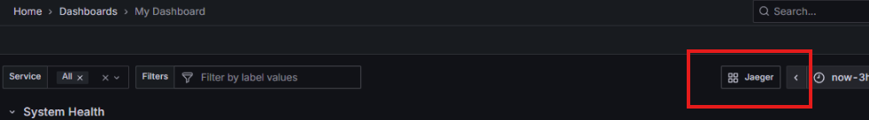
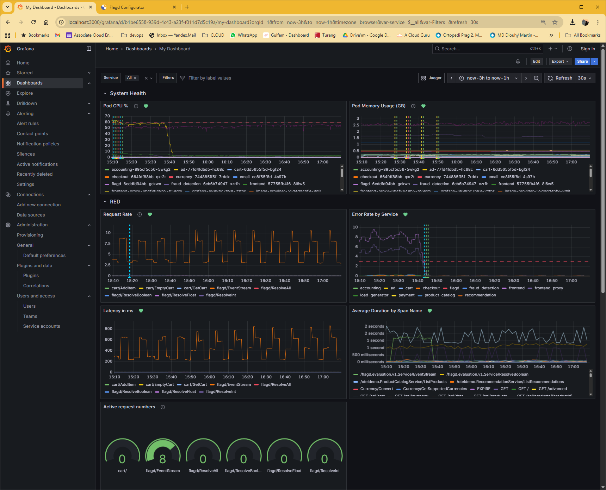
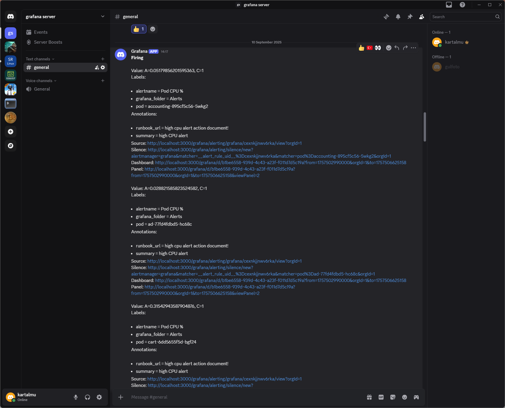
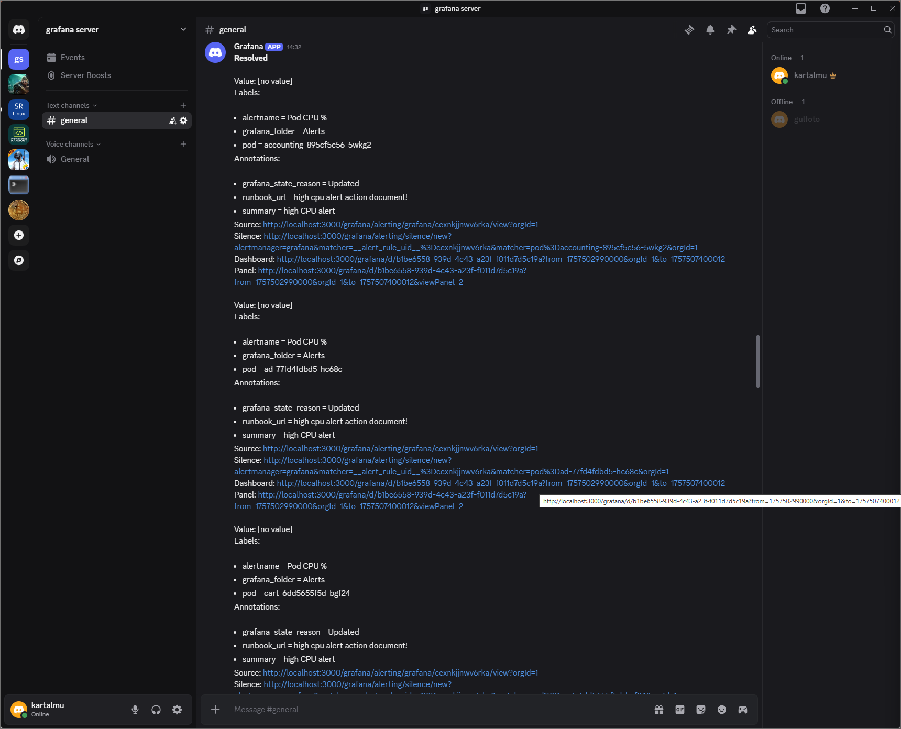

# Observability for OpenTelemetry Demo on GCP

This document outlines the approach and design decisions for enhancing the observability of the OpenTelemetry Demo application deployed on Google Kubernetes Engine (GKE). The goal is to provide comprehensive, production-ready monitoring and alerting capabilities as per the assignment requirements.

## 1. Deployment and Instrumentation

### Infrastructure Overview

The OpenTelemetry Demo application was deployed on Google Kubernetes Engine (GKE) using Terraform for Infrastructure as Code (IaC) and Helm for application deployment. This provides a production-like environment with built-in observability instrumentation across multiple microservices.

**Key Components:**
- **GKE Cluster**: Managed Kubernetes environment on GCP
- **Terraform IaC**: Automated infrastructure provisioning
- **Helm Deployment**: Official OpenTelemetry Demo chart with 10+ instrumented microservices
- **Built-in Telemetry**: Automatic metrics, traces, and logs collection

The demo includes realistic services (frontend, cart, checkout, payment, etc.) with comprehensive OpenTelemetry instrumentation, providing rich observability data for monitoring and alerting.

## 2. Metrics Visualization and Dashboarding

### Dashboard Design Philosophy

The Grafana dashboard follows a structured observability approach, integrating multiple data sources into a cohesive monitoring solution:

**Data Source Integration:**
- **Row 1 & 2 - Prometheus Metrics**: Infrastructure health (CPU, Memory) and RED metrics (Rate, Errors, Duration) from Prometheus for real-time performance monitoring
- **Row 3 - OpenSearch Logs**: Application logs and log severity analysis from OpenSearch for behavioral insights and error pattern detection
- **Row 4 - Jaeger Tracing**: Service dependency visualization from Jaeger for understanding request flows and system architecture

**Navigation Integration**: A direct Jaeger link is positioned at the top of the dashboard (next to service filters), enabling engineers to seamlessly transition from metrics/logs to distributed tracing. Users can take trace IDs from logs and directly investigate detailed request paths in Jaeger.


*Dashboard header showing Jaeger link positioned next to service filters for seamless trace investigation*

**Core Design Principles:**

1.  **Clarity**: The dashboard provides hierarchical observability - starting with infrastructure health (Prometheus), drilling into application behavior (logs from OpenSearch), and enabling deep trace analysis (Jaeger). This layered approach gives engineers a complete system view from infrastructure to individual request traces.

2.  **Information Density**: Each row serves a specific observability purpose without overlap. Prometheus delivers quantitative performance data, OpenSearch provides qualitative behavioral insights, and Jaeger offers detailed request flow analysis. This multi-source approach ensures comprehensive coverage while maintaining focused, actionable information density.

3.  **Actionable Insights**: Every panel answers specific operational questions - Prometheus metrics reveal "what's happening" (performance degradation), OpenSearch logs explain "why it's happening" (error patterns, application state), and Jaeger traces show "how it's happening" (request paths, service interactions). The integrated Jaeger link enables immediate deep-dive investigation from any metric anomaly or log pattern.

The dashboard includes template variables for service filtering, allowing engineers to focus on specific services or view system-wide metrics across all services simultaneously.


*Main dashboard view showing the complete observability suite with System Health and RED metrics sections*

### Detailed Dashboard Panel Analysis

The dashboard is organized into multiple rows: **System Health**, **RED Metrics**, **Logs**, and **Service Dependencies**, providing comprehensive monitoring coverage.

#### System Health Section


*Top section showing infrastructure health metrics*

**1. Pod CPU Usage (%)**
- **Query**: `100 * sum(rate(container_cpu_usage_seconds_total{namespace="otel-demo"}[5m])) by (pod) / 12`
- **Purpose**: Monitors CPU utilization across all pods in the otel-demo namespace as a percentage of total available CPU cores (12 cores total)
- **Design Decision**: Shows percentage rather than raw CPU seconds to make it immediately actionable. The 5-minute rate provides smoothed data to avoid noise from brief spikes

**2. Pod Memory Usage (GB)**
- **Query**: `sum by(pod) (container_memory_working_set_bytes{namespace="otel-demo", pod!=""}) / 1024 / 1024 / 1024`
- **Purpose**: Tracks memory consumption in gigabytes for all pods, using working set memory which represents actual memory in use
- **Design Decision**: Converted from bytes to GB for readability. Working set memory is chosen over other memory metrics as it reflects actual memory pressure

#### RED Metrics Section

**3. Request Rate**
- **Query**: Complex query using `label_join` and `label_replace` to create readable service/route combinations
- **Purpose**: Shows the number of HTTP requests per second, broken down by service and route
- **Custom Enhancement**: Uses regex `".*/([^/]+)$"` to extract only the last segment of HTTP routes, making labels cleaner (e.g., "/api/v1/users" becomes just "users")
- **Service Template Variable**: Leverages `$service` variable allowing filtering by specific services or viewing "all"

**4. Error Rate by Service**
- **Query**: `sum by(service_name) (rate(traces_span_metrics_calls_total{service_name=~"$service",status_code="STATUS_CODE_ERROR"}[5m]))`
- **Purpose**: Tracks errors per second by service using OpenTelemetry span metrics
- **Design Decision**: Uses span-based error tracking rather than HTTP status codes to capture errors across all service interactions, not just HTTP
- **Alert Integration**: This metric directly feeds into the alerting system for proactive issue detection

**5. Latency in Milliseconds**
- **Query**: Calculates latency by dividing duration sum by request count for each service/route combination, multiplied by 100 for millisecond conversion
- **Purpose**: Shows actual response times for each service endpoint
- **Custom Labels**: Same route simplification logic applied for consistent labeling across panels
- **Actionability**: Helps identify slow endpoints that may need optimization

#### Log Monitoring Section

**6. Application Log Records & Log Records by Severity**
- **Data Source**: OpenSearch logs from the otel-demo namespace
- **Purpose**: Provides log-based insights to complement metrics
- **Implementation**: Shows log volume and severity distribution to identify patterns in application behavior
- **Integration**: Links logs to metrics timeline for correlated troubleshooting

#### Service Dependencies

**7. Service Dependency Visualization**
- **Data Source**: Jaeger tracing data
- **Purpose**: Shows service-to-service communication patterns
- **Value**: Helps understand system architecture and identify critical service paths

### Custom Enhancements and Innovations

#### 1. Advanced Label Engineering
The dashboard implements sophisticated label transformation to improve readability and usability:
```promql
label_replace(
  rate(http_server_request_duration_seconds_sum{service_name=~"$service"}[5m]),
  "short_http_route",
  "$1",
  "http_route",
  ".*/([^/]+)$"  # Extract last URL segment
)
```
This transformation converts verbose paths like "/api/recommendations/v1/products" to simply "products", dramatically improving dashboard readability and making it easier to identify performance issues at a glance.

#### 2. Multi-Source Data Integration
- **Prometheus**: Real-time metrics for infrastructure and application performance
- **OpenSearch**: Log aggregation and analysis for behavioral insights
- **Jaeger**: Distributed tracing for request flow visualization
- **Seamless Navigation**: Direct links between data sources for comprehensive troubleshooting

## 3. Comprehensive Alerting Strategy

### Implemented Alerts Overview

I implemented **6 production-ready alerts** covering infrastructure, application performance, and log-based monitoring:

1. **Error Rate Alert** (Prometheus-based)
2. **Pod CPU % Alert** (Prometheus-based)
3. **Pod Memory Usage Alert** (Prometheus-based with baseline comparison)
4. **Latency Alert** (Prometheus-based)
5. **Request Rate Anomaly Alert** (Prometheus-based with baseline comparison)
6. **Error Log Alert** (OpenSearch-based)

All alerts integrate with **Discord** for immediate team notification.

### Alert #1: Error Rate Monitoring

**Configuration:**
```yaml
title: "Error Rate"
query: "sum by(service_name) (rate(traces_span_metrics_calls_total{status_code=\"STATUS_CODE_ERROR\"}[5m]))"
threshold: "> 2 errors/second"
evaluation_time: "1 minute"
```

**Design Rationale:**
- **Span-Based Tracking**: Captures errors across all service interactions (gRPC, database calls, message queues), not just HTTP requests
- **Rate Function**: `rate()[5m]` provides errors per second over a 5-minute window, smoothing transient spikes
- **Business Impact**: 2 errors/second threshold balances sensitivity with noise reduction
- **Service Granularity**: `sum by(service_name)` allows pinpointing which service is experiencing issues

### Alert #2: Infrastructure CPU Monitoring

**Configuration:**
```yaml
title: "Pod CPU %"
query: "100 * sum(rate(container_cpu_usage_seconds_total{namespace=\"otel-demo\"}[5m])) by (pod) / 12"
threshold: "> 60%"
evaluation_time: "1 minute"
```

**Design Rationale:**
- **Percentage-Based**: Easy to interpret and actionable threshold
- **Pod-Level Granularity**: Identifies specific pods under CPU pressure
- **Resource Planning**: 60% threshold provides early warning before resource exhaustion

### Alert #3: Advanced Memory Anomaly Detection

**Configuration:**
```yaml
title: "Pod Memory Usage (GB)"
query: |
  (
    sum by(pod) (container_memory_working_set_bytes{namespace=\"otel-demo\", pod!=""})
    /
    sum by(pod) (container_memory_working_set_bytes{namespace=\"otel-demo\", pod!=""} offset 10m)
  )
threshold: "> 10x baseline"
evaluation_time: "1 minute"
```

**Advanced Query Logic:**
1. **Current Memory Usage**: `container_memory_working_set_bytes{namespace="otel-demo"}` 
2. **Baseline Comparison**: Same metric with `offset 10m` to get values from 10 minutes ago
3. **Ratio Calculation**: Current usage divided by historical baseline
4. **Dynamic Threshold**: Alert triggers when current usage is 10x higher than 10 minutes ago

**Strategic Benefits:**
- **Dynamic Thresholding**: Adapts to normal application patterns rather than static limits
- **Anomaly Detection**: Catches unusual spikes even during different traffic patterns
- **Context Awareness**: A spike at 3AM is more significant than during peak hours
- **Reduces False Positives**: Prevents alerts during expected traffic variations

### Alert #4: Latency Performance Monitoring

**Configuration:**
```yaml
title: "Latency in ms"
query: "Complex calculation converting duration to milliseconds by service/route"
threshold: "> 1000ms (1 second)"
evaluation_time: "1 minute"
```

**Design Rationale:**
- **User Experience Focus**: 1-second threshold directly impacts user satisfaction
- **Service/Route Breakdown**: Identifies specific endpoints causing performance issues
- **Custom Label Logic**: Same route simplification for consistent alerting

### Alert #5: Request Rate Anomaly Detection

**Configuration:**
```yaml
title: "Request Rate"
query: |
  (abs(
    sum(rate(http_server_request_duration_seconds_count[5m])) by (service_name)
    -
    avg_over_time(sum(rate(http_server_request_duration_seconds_count[5m])) by (service_name)[1h:5m])
  )
  /
  avg_over_time(sum(rate(http_server_request_duration_seconds_count[5m])) by (service_name)[1h:5m])
  )
threshold: "> 50% deviation from 1-hour average"
evaluation_time: "1 minute"
```

**Advanced Features:**
- **Baseline Comparison**: Compares current rate to 1-hour rolling average
- **Percentage Deviation**: 50% change threshold catches significant traffic anomalies
- **Bidirectional Detection**: Catches both traffic spikes and unexpected drops
- **Service-Level Granularity**: Identifies which services are experiencing unusual traffic patterns

### Alert #6: Log-Based Error Detection (OpenSearch)

**Configuration:**
```yaml
title: "Error Log Alert"
data_source: "OpenSearch"
query: "resource.service.name:\"recommendation\" AND severity.text:\"ERROR\""
threshold: "> 10 error logs"
time_window: "10 minutes"
```

**Implementation Details:**
- **Service-Specific**: Targets the "recommendation" service for focused monitoring
- **Severity Filtering**: Only ERROR-level logs trigger the alert
- **Log Count Threshold**: 10 error logs in 10 minutes indicates a problem pattern
- **Early Detection**: Catches issues that might not immediately impact metrics

### Alert Notification Integration

All alerts integrate with **Discord** for immediate team notification:

#### Active Alert Notification

*Discord alert notification showing the triggered condition, affected service, and direct link to dashboard for immediate investigation*

#### Resolution Notification

*Resolution notification confirming the alert has cleared, providing closure for the incident*

**Alert Message Benefits:**
- **Service Identification**: Clear indication of which service/metric is affected
- **Metric Values**: Current values vs. thresholds for context
- **Direct Dashboard Links**: One-click access to full debugging context
- **Automatic Resolution**: Confirms when issues resolve without manual intervention

## 4. Key Design Decisions and Technical Competencies

This observability implementation demonstrates several critical production skills:

### Dashboard Design Excellence
- **Multi-Source Integration**: Seamlessly combines Prometheus, OpenSearch, and Jaeger data
- **Advanced Label Engineering**: Regex-based URL simplification for improved readability
- **Template Variables**: Service filtering with "All" option for system-wide and focused views
- **Navigation Integration**: Direct Jaeger links for trace investigation

### Production-Ready Alerting
- **Comprehensive Coverage**: 6 alerts covering infrastructure, application, and logs
- **Smart Thresholding**: Dynamic baselines and percentage-based thresholds
- **Advanced Queries**: Offset comparisons and rolling averages for anomaly detection
- **Multi-Channel Integration**: Discord notifications with resolution confirmations

### Observability Best Practices
- **Infrastructure Monitoring**: CPU/Memory tracking with intelligent thresholds
- **Application Performance**: Latency and error rate monitoring with business context
- **Log Integration**: OpenSearch-based error pattern detection
- **Service Dependencies**: Jaeger-based architecture visualization

### DevOps Engineering Skills
- **Infrastructure as Code**: Terraform for reproducible GKE deployments
- **Container Orchestration**: Kubernetes namespace and resource management
- **Monitoring as Code**: Version-controlled dashboards and alert definitions
- **Incident Response**: Automated alerting with clear escalation paths

## 5. Deliverables Summary

### Repository Structure
```
├── main.tf                           # Terraform: GCP resources and providers
├── variables.tf                      # Terraform: Configurable parameters  
├── outputs.tf                        # Terraform: Cluster connection info
├── gke_and_app.tf                   # Terraform: GKE and Helm deployment
├── alert-rules-1757538351495.json   # Grafana: 6 comprehensive alert definitions
├── My Dashboard-1757532431060.json  # Grafana: Multi-source dashboard configuration
├── MyDashboard01.png                # Visual: Dashboard overview with navigation
├── MyDashboard02.png                # Visual: RED metrics and log analysis detail
├── Discord-messageforalert.png      # Visual: Alert notification example
├── Discord-messageforresolved.png   # Visual: Resolution notification example
└── README.md                        # Implementation documentation
```

This solution demonstrates production-ready observability engineering with focus on actionable monitoring, intelligent alerting, and comprehensive incident response workflows using real-world tools and best practices.
